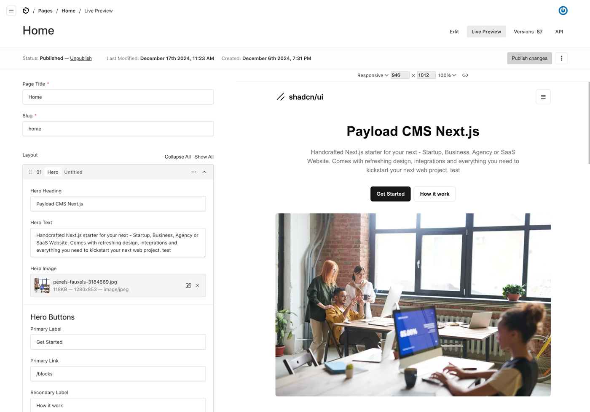

# Payload Next shadcn/ui Template

This template includes a beautifully designed, production-ready front-end built with the [Next.js App Router](https://nextjs.org), served right alongside your Payload app in a instance.

Payload Docs: [https://payloadcms.com/docs/getting-started/what-is-payload](https://payloadcms.com/docs/getting-started/what-is-payload).



Core features:

- [Pre-configured Payload Config](#setup)
- [Pages Collection with Layout Blocks](#pages-collection)
- [Layout Blocks made with shadcn/ui](#layout-blocks)
- [Media Collection](#media-collection)
- Draft Preview
- Live Preview
- Globals: Header and Footer
- Navigation Menus: Header, Footer, Mobile
- [Customization](#customization)

## Setup

Fork this repo to your namespace and clone it to your local machine.

Clone:

```
git clone https://github.com/<YOUR NAME>/payload-next-shadcn.git
```

cd my-project

install dependencies:‚

```
npm install
```

Setup a compatible database (MongoDB or Postgres).

Copy the .env.example and rename it to .env.

When the database is created, add the access data to the .env file of the project:

DATABASE_URI=
PAYLOAD_SECRET=YOUR_SECRET_HERE
PAYLOAD_PUBLIC_PREVIEW_SECRET=YOUR_PREVIEW_SECRET_HERE
NEXT_PREVIEW_SECRET=YOUR_PREVIEW_SECRET_HERE

PAYLOAD_PUBLIC_PREVIEW_SECRET and NEXT_PREVIEW_SECRET must have the same value !

run the app in dev mode

```
npm run dev
```

Open localhost:3000 in your browser: http://localhost:3000/

Now go to: http://localhost:3000/admin

Create the first Admin User and login.

## Pages Collection

All pages are layout builder enabled so you can generate unique layouts for each page using layout-building blocks, see Layout Builder for more details. Pages are also draft-enabled so you can preview them before publishing them to your website.

Config Pages: [/src/collections/Pages.ts](https://github.com/mrtzdev/payload-next-shadcn/blob/main/src/collections/Pages.ts)

## Layout Blocks

This template comes pre-configured with the following layout blocks:

- Call To Action
- FAQ
- Features
- Grid Cards
- Hero
- Logos
- Quote
- Rich Text

The Block Components are made with [TailwindCSS styling](https://tailwindcss.com/) and [shadcn/ui components](https://ui.shadcn.com/)

## Media Collection

Config Pages: [/src/collections/Media.ts](https://github.com/mrtzdev/payload-next-shadcn/blob/main/src/collections/Media.ts)

Media Docs: [https://payloadcms.com/docs/upload/overview](https://payloadcms.com/docs/upload/overview)

## Customization

### Styles

You can use css variables for theming: [global.css](<https://github.com/mrtzdev/payload-next-shadcn/blob/main/src/app/(frontend)/globals.css>)

shadcn/ui themes: [https://ui.shadcn.com/themes](https://ui.shadcn.com/themes)

### Add new Layout Blocks

New layout blocks can easily be added:

- Add a file to /src/collections/blocks ( for Payload Admin Backend ) and add the fields. See Payload Docs: [https://payloadcms.com/docs/fields/overview](https://payloadcms.com/docs/fields/overview)
- Import it to Pages.ts and add it to CollectionConfig to blocks.
- Create a new file for your Block: /src/components/blocks
- Import it to /src/components/blocks/blocks.tsx

Now you can use your new block for the page layouts.
